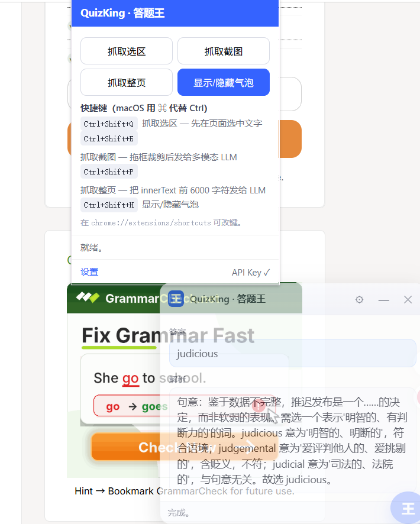
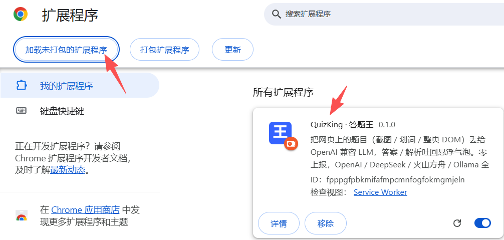
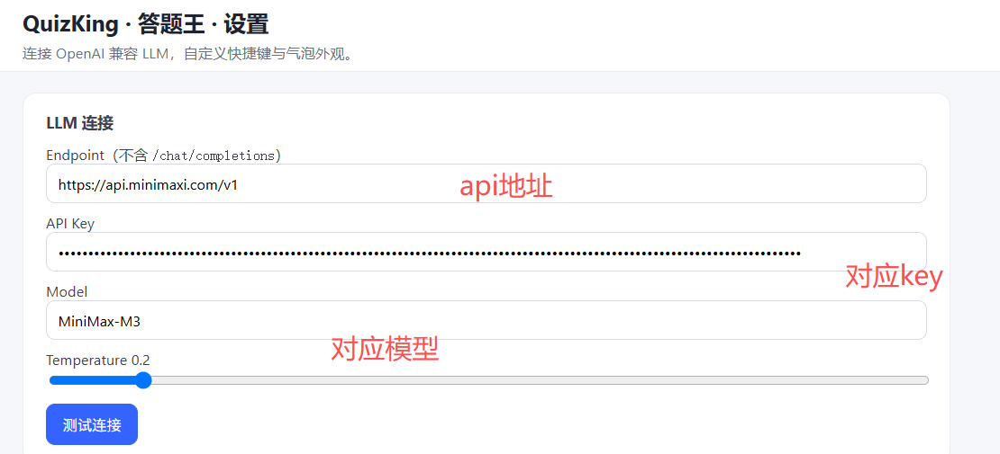
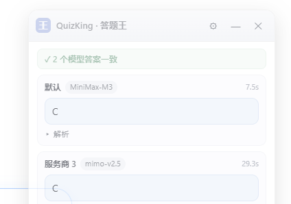
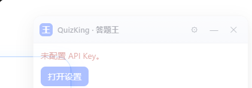
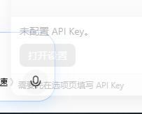
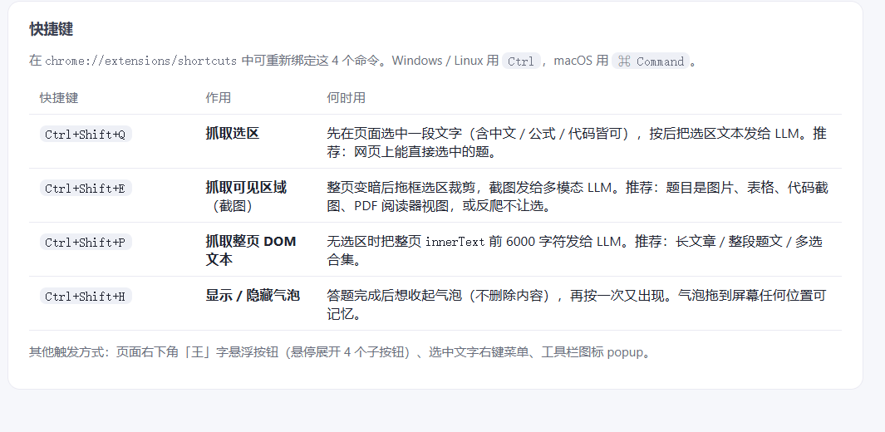
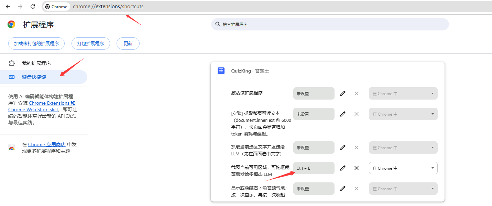

<div align="center">

# QuizKing · 答题王

> 把网页上看到的题目（截图 / 划词 / DOM）丢给 OpenAI 兼容 LLM，把答案 / 解析吐回悬浮气泡。

[](../../releases)
[](./LICENSE)
[](#技术栈)
[](#安装)
[](#隐私与安全)
[](../../pulls)
[](https://space.bilibili.com/97727630)

</div>

## 目录

- [特性](#特性)
- [30 秒试用](#30-秒试用)
- [安装](#安装)
- [配置](#配置)
- [使用](#使用)
- [架构](#架构)
- [消息路由](#消息路由)
- [开发](#开发)
- [FAQ](#faq)
- [隐私与安全](#隐私与安全)
- [路线图](#路线图)
- [贡献](#贡献)
- [作者](#作者)
- [许可](#许可)

## 特性

- **三通道采集** — 划词文本 / 整页 DOM 文本 / 可见区域截图 + 框选裁剪
- **多 API 并行对比** — 可配置多个服务商（各自 Endpoint / Key / Model），抓题时同时调用，**谁先返回谁先显示**，答案并列展示并标记是否一致
- **OpenAI 兼容 endpoint** — OpenAI / DeepSeek / 火山方舟 / Ollama 全部可接
- **两种 Prompt 模式** — 答案 + 解析（默认）/ 自定义
- **可拖动悬浮气泡**，可设透明度（0.4–1.0），调低后自动去色淡化、融入页面，ESC 隐藏，⚙ 跳设置
- **多触发方式** — 快捷键 / 右键菜单 / 浮动按钮 / 工具栏 popup
- **本地历史** — 最近 200 条（可关），一键清空
- **脏标记** — 选项页改了任何字段都会高亮「● 有未保存的修改」直到点保存
- **零上报** — 不接任何第三方分析 / 统计 / beacon

## 30 秒试用

```bash
# 1. 拉代码（你已经在了）
# 2. Chrome → chrome://extensions/ → 开发者模式 → 加载已解压 → 选 src/
# 3. 工具栏出现「王」字蓝色图标
# 4. 划一段文字 → Ctrl+Shift+Q → 气泡出答案
```

完整配置见 [配置](#配置)。先不填 key 也行，会跳到「未配置 API Key」提示。




## 安装

### 开发者模式（推荐，先跑通）

1. 打开 `chrome://extensions/`
2. 右上角打开「开发者模式」
3. 点「加载已解压的扩展程序」 → 选本仓库 `src/` 目录
4. 工具栏出现「王」字蓝色图标 → 安装成功



> Edge 用户：在 `edge://extensions/` 同理，开发者模式 + 加载已解压。

### 从 Chrome Web Store 安装

> 发布到商店后填入永久链接。

## 配置

1. 工具栏点「王」字图标 → 「设置」打开选项页
2. 在「LLM 连接」点「＋ 添加服务商」，每个服务商填：
   - **名称**：自定义标签（如 `DeepSeek`），气泡里用它标识答案来源
   - **Endpoint**：例如 `https://api.openai.com/v1`（**不要**带 `/chat/completions`，插件自动拼）
   - **API Key**：`sk-...`，存于 `chrome.storage.sync`，不上报
   - **Model**：默认 `gpt-4o-mini`，多模态截图建议 `gpt-4o-mini` / `qwen-vl-max` / `doubao-1.5-vision`
   - **启用**：取消勾选即临时停用，不删配置
   - **Temperature / System Prompt**：所有服务商共用，见下「Prompt 模式」
3. 点单个服务商的「测试」验证连通，或点「测试全部」一次测完
4. 改任何字段都会显示「● 有未保存的修改」 → 点底部「保存」

> 从旧版本升级无需重填：原来的 Endpoint / API Key / Model 会自动迁移为第一个服务商。



### 多 API 并行对比

启用多个服务商后，每次抓题会**同时**向它们发请求（真并发，总耗时约等于最慢的那个），气泡里并列展示各自答案：

| 情况 | 气泡表现 |
| --- | --- |
| 全部一致 | 顶部标 `✓ N 个模型答案一致` |
| 出现分歧 | 顶部标 `⚠ 答案不一致（2/3 一致）`，少数派那张卡加「少数」角标 |
| 某个服务商报错 | 该卡变红显示原因（如 `HTTP 401`），其余答案照常显示 |
| 只启用一个 | 显示与单 API 完全一致，不出现对比标记 |



**结果先后返回，不等最慢的**：发请求是所有服务商并行，但**谁先返回就先画进气泡**——气泡先画出全部服务商的占位卡（标「等待中…」），随后每返回一个就填充一张，状态栏显示「已返回 2/3，等待其余模型…」。一致性徽章也随之逐步更新（等待期间显示灰色 `等待模型返回…`）。所以快模型的结果不用等慢模型。

单个服务商 45 秒无响应会被判定超时（显示「超时（45s 无响应）」），不会让气泡一直转圈。

解析默认折叠，点「解析」展开。注意：图片题会发给**所有**启用的服务商，不支持视觉的模型会报错并显示为失败卡。

### 气泡透明度

选项页「外观与历史」→「气泡透明度」滑块（0.4–1.0）。调低后气泡自动去色淡化；最低档时标题与彩色图标隐藏，只剩浅淡轮廓融入页面：

| 修改前 | 修改后（最低透明度） |
| --- | --- |
|  |  |

### Prompt 模式

| 模式 | system prompt | 气泡显示 |
| --- | --- | --- |
| 答案 + 解析（默认） | 严格 JSON `{answer, reasoning}` | 「答案」+「解析」 |
| 自定义 | 你写的文本 | 按模式判定 |

## 使用

| 快捷键 | 作用 | 何时用 |
| --- | --- | --- |
| `Ctrl+Shift+Q`（macOS `⌘⇧Q`） | **抓取选区** | 先在页面选中一段文字，按后把选中文本发给 LLM。适合：网页上能直接选中的题目。 |
| `Ctrl+Shift+E` | **抓取可见区域**（截图） | 整页变暗后拖框选区裁剪，截图发给多模态 LLM。适合：题目是图片、表格、代码截图、PDF 阅读器、反爬不让选的页面。 |
| `Ctrl+Shift+P` | **抓取整页 DOM 文本** <sub>⚠ 实验</sub> | 把整页 `innerText` 前 6000 字符发给 LLM。适合：长文章、整段题文、多选合集。⚠ **实验性**：长文本会显著增加 token 消耗与延迟；多数场景用「划词」更准。 |
| `Ctrl+Shift+H` | **显示 / 隐藏气泡** | 答题完成后想收起气泡（不丢内容），再按一次又出现。 |

> 在 `chrome://extensions/shortcuts` 可重新绑定这 4 个命令。



**快捷键没反应？** 常见原因是默认组合键在注册时被其他扩展占用（Chrome 会静默跳过，在设置页显示「未设置」），或被输入法 / 常驻软件全局抢占。打开 `chrome://extensions/shortcuts`，点击对应命令右侧的快捷键输入框，直接按下想用的组合键即可，修改即时生效，无需重载扩展：



**其他触发方式**

- 页面右下角悬浮「王」字按钮 → 鼠标悬停展开「选区 / 截图 / 整页 / 气泡」
- 选中文字 → 右键 → 「抓取选区并问 AI」 / 「抓取可见区域并问 AI」 / 「抓取整页 DOM 文本并问 AI」 / 「关闭当前 AI 气泡」
- 工具栏图标 → 弹 popup → 四个按钮（含详细快捷键说明）

## 架构

```
┌──────────────────┐    ┌──────────────────┐    ┌──────────────┐
│  popup.html      │    │  background.js   │    │  options.html│
│  (toolbar)       │    │  (service worker)│    │  (settings)  │
└────────┬─────────┘    └────────┬─────────┘    └──────┬───────┘
         │ chrome.runtime        │                       │
         │ .sendMessage          │                       │
         ▼                       ▼                       │
┌─────────────────────────────────────────┐             │
│           content.js (page)              │  ◄──────────┘
│  - capture (selection / visible / page)  │   chrome.storage.sync
│  - bubble UI + FAB                        │   (providers[] /
│  - parseAnswer, showAnswer（多路并列）    │    promptMode /
│  - 一致性标记 / 少数派角标                │    bubbleOpacity / …)
└────────────────────┬────────────────────┘
                     │ chrome.runtime.sendMessage
                     ▼
            background.js 并行扇出（Promise.allSettled，单个失败不阻塞其余）
                ├─ provider A → POST /chat/completions
                ├─ provider B → POST /chat/completions
                └─ provider C → POST /chat/completions
                     │
                     ▼  结果聚合为 items[]，回传气泡并列展示
```

### 文件树

```
QuizKing/
├─ assets/
│  └─ screenshots/                # README 截图
├─ src/                           # 扩展源码（加载这一层即可运行）
│  ├─ manifest.json               # MV3 manifest
│  ├─ background.js               # service worker：命令路由 / LLM HTTP / 存储
│  ├─ content.js                  # 内容脚本：捕获通道 / 气泡 / FAB
│  ├─ bubble.css                  # 气泡样式
│  ├─ popup.html / popup.js
│  ├─ options.html / options.css / options.js
│  ├─ _locales/zh_CN/messages.json
│  └─ icons/                      # 16 / 48 / 128 王字 PNG
├─ .github/
│  ├─ ISSUE_TEMPLATE/             # bug / feature 模板
│  └─ PULL_REQUEST_TEMPLATE.md
docs/  .doc/                      # 本地文档（已在 .gitignore，不随仓库发布）
├─ .editorconfig
├─ .gitignore
├─ FAQ.md
├─ LICENSE
├─ README.md
└─ SECURITY.md
```

## 消息路由

`background.js` 暴露以下 `chrome.runtime.onMessage` 入口：

| type | 行为 | 返回 |
| --- | --- | --- |
| `aqh/get-config` | 读 storage，逐条剥离 `apiKey` | `{ ok, cfg, hasKey }` |
| `aqh/capture-visible-tab` | `chrome.tabs.captureVisibleTab` | `{ ok, dataUrl }` |
| `aqh/ask` | 立即回执服务商名单，随后并行调用 + 增量推送结果 | `{ ok, result: { reqId, pending[], promptMode } }` |
| `aqh/test` | 仅探测 storage 状态 | `{ ok, cfg, hasKey, providerCount }` |
| `aqh/selftest` | 默认关闭，需 `self.__AQH_SELFTEST__ = true` | `{ ok, cfg, routes, flags }` |

`aqh/ask` 的结果不走响应体，而是由 background 主动推送（`chrome.tabs.sendMessage`）：

| 推送 type | 时机 | payload |
| --- | --- | --- |
| `aqh/ask-item` | 每有一个服务商返回或失败 | `{ reqId, item }` |
| `aqh/ask-finish` | 全部落定 | `{ reqId, items[], promptMode }` |

> 内部协议命名空间为 `aqh/`（保持稳定，便于第三方工具集成）。

`content.js` 自己处理：

| type | 行为 |
| --- | --- |
| `aqh/capture` | 触发 selection / visible / page / toggle |
| `aqh/close` | 关闭气泡 |
| `aqh/ping` | 探活 |

## 开发

### 本地运行

```bash
# 1. 改 src/ 下的代码
# 2. chrome://extensions/ → QuizKing → ♻ 重新加载
# 3. 普通网页 F12 → console 看 [aqh] 调试日志
# 4. SW DevTools: chrome://extensions → "service worker" 链接 → console
```

### 静态检查

```bash
node --check src/*.js
node -e "JSON.parse(require('fs').readFileSync('src/manifest.json','utf8'))"
node -e "JSON.parse(require('fs').readFileSync('src/_locales/zh_CN/messages.json','utf8'))"
```

### 调试 Hook

```js
// SW DevTools console
self.__AQH_SELFTEST__ = true;
chrome.runtime.sendMessage({ type: "aqh/selftest" }, console.log);
// → { ok: true, cfg, routes, flags }
```

不依赖 LLM 网络 —— 用于离线核对 wiring 是否就绪。

### 重新生成图标

`src/icons/icon.svg` 是唯一源。生成 16/48/128 PNG：

```bash
NODE_PATH=./_icontools/node_modules node -e "
const sharp = require('sharp');
const fs = require('fs');
const svg = fs.readFileSync('src/icons/icon.svg');
(async () => {
  for (const s of [16, 48, 128]) {
    fs.writeFileSync('src/icons/icon' + s + '.png',
      await sharp(svg, { density: 300 }).resize(s, s).png().toBuffer());
  }
})();
"
```

## FAQ

最常见问题看 [FAQ.md](./FAQ.md)。**先查 FAQ 再开 issue**。

## 隐私与安全

- **API Key** 只存于 `chrome.storage.sync`，永不上报
- **fetch 出站** 只去用户在设置里填的 `endpoint`（多服务商时即你启用的那几个），**没有**其他任何外发
- **history** 仅写 `chrome.storage.local`，默认保存最近 200 条，可在选项页关闭 / 清空
- **content 脚本**永远拿不到 `apiKey`（`sanitizeCfg` 逐条剥离后回传）
- **控制台日志** 只输出长度统计 / 通用错误消息，**不含**用户文本或 key
- 安全问题不要开 public issue，按 [SECURITY.md](./SECURITY.md) 流程报告

### Manifest 权限

| 权限 | 用途 |
| --- | --- |
| `storage` | 读 / 写 `chrome.storage.sync` & `.local` |
| `activeTab` | popup 获取当前 tab id |
| `contextMenus` | 注册右键菜单 |
| `scripting` | 截图 / 注入 |
| `notifications` | （预留）错误提示 |
| `host_permissions: <all_urls>` | content 脚本可注入任意页以捕获内容 |

> `host_permissions` 仅用于 content 注入；不出站。

## 路线图

- [ ] 选择 / 判断 / 填空的结构化答案注入
- [ ] 题型 Prompt 模板库（数学 / 编程 / 英语 / 医学）
- [ ] 站点规则：每个域名可独立 prompt + 模型
- [ ] 本地 OCR 引擎（Tesseract.js）作为非视觉模型 fallback
- [ ] Firefox 适配
- [ ] Chrome Web Store 发布

## 贡献

欢迎 fork & PR：

1. Fork & 创建分支
2. `node --check src/*.js` 通过
3. 自测：在 `chrome://extensions` 重载扩展后，用「划词 / 截图 / 整页」三条通道各抓一题，确认气泡出答案
4. 提 PR，附带：改了什么 / 为什么 / 怎么验证 / 风险点
5. 维护者审 → 合入

## 作者

[](https://space.bilibili.com/97727630)

问题反馈 / 合作 / 想看教程 → B 站私信。


## 致谢

- [linux.do](https://linux.do/) — 中文独立技术社区，给了工具 / 思路上的大量启发与反馈

## 许可

[MIT](./LICENSE) — 自由使用、修改、分发。

---

<div align="center">

Made with care for students, self-learners, and anyone staring at quiz screenshots at 2 a.m.

</div>
